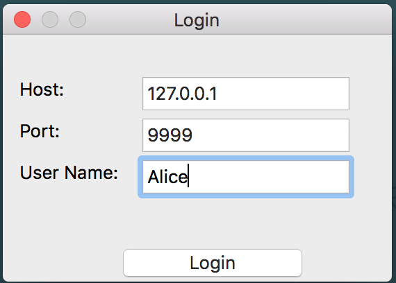

## Socket 编程

### 概述
此PJ设计的网络协议为类似HTTP/1.1协议: **ChatHTTP**， 该协议主要服务于简单的聊天室。  
选择的参考题目为4，实现一个***简单的聊天系统***， 该聊天系统为群聊系统。

[Github地址：Sorosliu1029/SocketProgram](https://github.com/Sorosliu1029/SocketProgram/)

### 目录

1. [ChatHTTP](#ChatHTTP)
2. [聊天室客户端](#Client)
3. [聊天室服务器端](#Server)  

### 1. ChatHTTP
ChatHTTP协议为一个***类似HTTP/1.1***的协议。协议的设计也主要参照了HTTP/1.1，并适当增减了**HTTP请求报文的方法**和**HTTP响应报文的状态码**。协议的其他部分和HTTP/1.1协议没有太大区别，ChatHTTP删去了HTTP/1.1中对于聊天系统用处不大的内容。

[Github http.py源代码](https://github.com/Sorosliu1029/SocketProgram/blob/master/self_work/http.py)

#### a.ChatHTTP请求报文

##### (1) 请求行

 * 请求报文的主要方法： 
  
    |   方法       |      含义                                                    |
    |:-------------:|:---------------------------------------------------- 
    |   ADD       |    加入群聊
    |   POST     |   提交聊天内容（并广播到所有其他用户）
    |    GET      |    查询在线用户（所有用户）
    |  DELETE    |   退出群聊
    
* 请求报文的URI：   
    由于聊天室服务器不会存储任何资源，故URI即是服务器主机的URL， 一般设置为'127.0.0.1'
    
* 请求的HTTP版本：  
    ChatHTTP的版本为‘HTTP/1.1’
    
##### (2) 头部行

* 通用头部：

    |    键         |     值                            |
    |:------------:|:-------------------------------
    | Datetime |  HTTP报文的生成时间
    
* 请求头部：
    
    |    键                      |     值                                |
    |:-----------------------:|:---------------------------------
    | Accept                  |  客户端接受的信息类型
    | Accept_Language| 客户端接受的自然语言
    | Accepy_Encoding | 客户端接受的内容编码
    | Host                      | 指定被请求资源的主机
    | User_Agent           | 客户端对应的用户名
    
* 实体头部：

    |    键                         |     值                               |
    |:--------------------------:|:---------------------------------
    | Content_Encoding   | 实体正文的内容编码
    | Content_Language  | 实体正文的自然语言
    | Content_Length       | 实体正文的长度
    | Content_Type          | 实体正文的信息类型
    
##### (3) 实体部分

当请求报文方法为**'ADD'**,**'GET'**,**'DELETE'**时， 实体部分为空；  
当请求报文方法为**'POST'**时，实体部分为该用户的聊天内容；  

##### (4) 请求报文示例

* 'ADD'请求报文：  

> ADD 127.0.0.1 HTTP/1.1  
> Datetime: 2015-11-29 10:07:40  
> User*_*Agent: Alice  
> Host: 127.0.0.1  
> Accept*_*Language: en  
> Accept: text  
> Accept*_*Encoding: utf-8  
> Content*_*Length: 0  
>Content*_*Language: en  
>Content*_*Encoding: utf-8  
>Content*_*Type: text  

* 'POST'请求报文：

> POST 127.0.0.1 HTTP/1.1  
Datetime: 2015-11-29 10:17:48  
User*_*Agent: Alice  
Host: 127.0.0.1  
Accept*_*Language: en  
Accept: text  
Accept*_*Encoding: utf-8  
Content*_*Length: 17  
Content*_*Language: en  
Content*_*Encoding: utf-8  
Content*_*Type: text  
>
>Hello, everyone!

* 'GET'请求报文：

>GET 127.0.0.1 HTTP/1.1  
Datetime: 2015-11-29 10:19:52  
User*_*Agent: Alice  
Host: 127.0.0.1  
Accept*_*Language: en  
Accept: text  
Accept*_*Encoding: utf-8  
Content*_*Length: 0  
Content*_*Language: en  
Content*_*Encoding: utf-8  
Content*_*Type: text  

* 'DELETE'请求报文：

>DELETE 127.0.0.1 HTTP/1.1  
Datetime: 2015-11-29 10:21:28  
User*_*Agent: Alice  
Host: 127.0.0.1  
Accept*_*Language: en  
Accept: text  
Accept*_*Encoding: utf-8  
Content*_*Length: 0  
Content*_*Language: en  
Content*_*Encoding: utf-8 
Content*_*Type: text  

#### b.ChatHTTP响应报文

##### (1) 响应行

* 响应报文的状态码及对应原因：

| 状态码        |   原因解释                                        |
|:---------------:|:-----------------------------------------------|
| 200             | OK(成功)
| 202             | Accept(连接已接受)
| 400             | Bad Request(不正确请求)
| 401             | User Name Exist(用户名已存在)
| 500             | Internal Server Error(内部服务器错误)

* 请求的HTTP版本：  
 ChatHTTP的版本为'HTTP/1.1'

##### (2) 头部行

* 通用头部：

    同请求报文的通用头部
    
* 响应头部：

    |    键                      |     值                                |
    |:-----------------------:|:---------------------------------
    | Server                  | 服务器的类型信息
    | Developer            | 服务器的开发者
    
* 实体头部：

    同请求报文的实体头部
    
##### (3) 实体部分

实体部分返回客户请求的信息， 或者群聊的广播聊天内容。  
如果出错，则返回错误信息

##### (4) 响应报文报文示例

* 连接成功响应报文

> HTTP/1.1 202 Accept  
Datetime: 2015-11-29 10:17:34  
Developer: Soros*_*Liu  
Server: Python Socket Server  
Content*_*Length: 4  
Content*_*Language: en  
Content*_*Encoding: utf-8  
Content*_*Type: text  

* 发送成功响应报文

>HTTP/1.1 200 OK  
Datetime: 2015-11-29 10:17:48  
Developer: Soros*_*Liu  
Server: Python Socket Server  
Content*_*Length: 29  
Content*_*Language: en  
Content*_*Encoding: utf-8  
Content*_*Type: text  
>
[ Alice ] : Hello, everyone!

* 错误信息响应报文

>HTTP/1.1 401 User Name Exist  
Datetime: 2015-11-29 10:44:14  
Developer: Soros*_*Liu  
Server: Python Socket Server  
Content*_*Length: 11  
Content*_*Language: en  
Content*_*Encoding: utf-8  
Content*_*Type: text  
>
Error...T.T   

### 2. 聊天室客户端

聊天室面向所有连接到服务器的用户，是一个群聊聊天室。  
提供的功能包含：

* 加入聊天室
* 发送聊天内容
* 查询当前在线用户
* 退出聊天室
* 提示有用户加入或退出

使用python **socket**库实现与服务器通信，**thread**库实现多线程处理服务器返回的响应报文， **wx**库实现图形化界面。  
从自己编写的**http**文件中加载**Request**，**Response**类，实现请求报文和响应报文的生成和处理。
因为聊天室只用于英语的纯文本聊天， 故HTTP报文头部的某些值设为固定值，例如'Encoding','Language','Content_Type'

[Github client.py源代码](https://github.com/Sorosliu1029/SocketProgram/blob/master/self_work/client.py)

#### a. 请求报文，响应报文的生成和处理

由于服务器与客户端之间传输的信息是字符串类型，所以需要把请求报文打包成字符串，将响应报文解析为**Response**类

* `handleResponse(raw_response)`： 处理服务器发回来的响应报文字符串，返回成响应报文的类实例
* `generateRequest()`:  根据情况生成请求报文的类实例

#### b. ChatClient

ChatClient继承了socket类，基于IPv4, TCP连接。  
ChatClient封装了socket的基本操作`connect()`,`close()`,`recv()`,`sendall()`，实现打开连接，关闭连接，接收信息，发送信息的操作。  

#### c. 登陆界面

* S1. 连接到服务器
* S2. 若S1失败,提示错误信息。否则检查用户名是否合法，合法的话发送登陆('ADD')的请求报文
* S3. 若S2成功，即登陆成功，则显示聊天室界面。否则提示错误信息

#### d. 聊天室界面

聊天窗口简单的使用**多行文本框**控件实现，有新的聊天内容到达，就将其追加到文本末尾。

* Send按钮: 发送聊天('POST')的请求报文
* Users按钮: 发送查询在线用户('GET')的请求报文
* Close按钮: 发送退出聊天('DELETE')的请求报文
* `receiveMessage()`：**客户端另外创建线程**，用来不间断地接收服务器发回的响应报文，将接收到的响应报文处理，然后将实体内容添加到聊天室界面中

### 3. 聊天室服务器端

服务器提供的功能包含：

* 支持多用户同时在线
* 支持客户端查询在线用户的请求
* 将某用户的聊天内容广播到其他用户客户端

使用python **socket**库实现与客户端通信，**thread**库实现多线程处理多用户连接。  
从自己编写的**http**文件中加载**Request**，**Response**类，实现请求报文和响应报文的生成和处理。  
因为聊天室只用于英语的纯文本聊天， 故HTTP报文头部的某些值设为固定值，例如'Encoding','Language','Content_Type','Server','Developer'  
内建一个字典映射，用于将**HTTP请求报文的方法**转换为**服务器命令处理方法**

| HTTP请求报文方法  |  服务器命令处理方法 |
|:---------------------------:|:----------------------------
| ADD                          | login
| POST                        | say
| GET                          | query
| DELETE                   | logout

[Github server.py源代码](https://github.com/Sorosliu1029/SocketProgram/blob/master/self_work/server.py)

#### a. 请求报文，响应报文的生成和处理

由于服务器与客户端之间传输的信息是字符串类型，所以需要把响应报文打包成字符串，将请求报文解析为**Request**类

* `handleRequest(raw_request)`： 处理客户端发过来的请求报文字符串，返回成请求报文的类实例
* `generateResponse()`:  根据情况生成响应报文的类实例

#### b. ChatServer

ChatServer继承了socket类，基于IPv4, TCP连接  

* 初始化服务器：

    流程为：创建socket ----> 绑定到指定IP地址和端口 ----> 开始监听  
    通过`users`字典维护 ***(用户， 客户端socket连接)*** 的对应关系
    
* `handle_accept()`：

  服务器用来处理客户端连接请求，并**创建新的线程用来处理这个客户端连接**。  
  使用多线程实现多用户同时在线的功能
    
* `singleConnect(conn, addr)`：

    用来处理单个客户端的连接请求。  
    连接成功则返回成功('202')的响应报文，并进入循环接收状态。  
    将接收到的请求报文预处理`handleRequest(raw_request)`，根据请求报文的'method'方法，转换成服务器命令，提交给命令处理器`cmdHandle`
    
* `cmdHandle(conn, userName, cmd, content)`：

    将所有服务器命令处理方法包装为统一接口。  
    根据服务器命令符，通过**Python*类属性获取***的方式，得到对应的命令处理方法
    
* `do_login(conn, userName, content)`：

    命令处理方法：处理客户端登陆请求。  
    * S1: 查询用户名是否已存在，若存在，返回错误信息。否则进行S2
    * S2: 向`users`字典中添加该用户的 ***(用户， 客户端socket连接)***
    * S3: 向该用户返回登陆成功的响应报文
    * S4: 向所有其他用户广播，有新的用户加入聊天室
    
* `do_say(conn, userName, content)`：

    命令处理方法：处理客户端发送聊天信息的请求。  
    * S1: 向该用户返回所发送的聊天信息
    * S2: 向所有其他用户广播该用户的聊天信息
    
* `do_query(conn, userName, content)`：

    命令处理方法：处理客户端查询当前在线用户的请求。  
    * S1: 向该用户返回`users`字典中所有的***用户名***
    
* `do_logout(conn, userName, content)`：

    命令处理方法： 处理客户端退出聊天室的请求。  
    * S1: 从`users`字典中删除该用户
    * S2: 向所有其他用户广播，该用户已经退出聊天室
    
* `broadcast(userName, content)`：

    根据`users`字典，除了`userName`外，向所有其他用户广播`content`内容。
